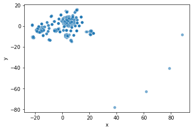
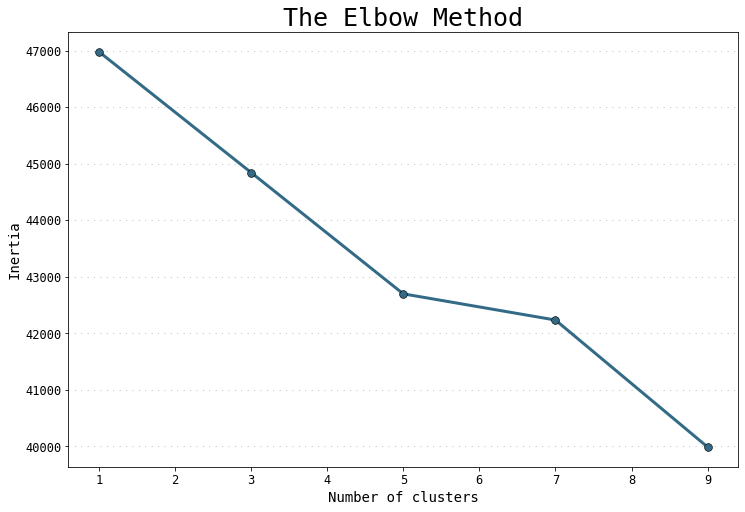

# Cryptocurrency Clusters

### Data Preparation

* Read `crypto_data.csv` into Pandas. The dataset was obtained from [CryptoCompare](https://min-api.cryptocompare.com/data/all/coinlist).

* Discard all cryptocurrencies that are not being traded by filtered for currencies that are currently being traded. Drop the `IsTrading` column from the dataframe.

* Remove all rows that have at least one null value.

* Filterd for cryptocurrencies that have been mined. That is, the total coins mined should be greater than zero.

* In order for the dataset to be comprehensible to a machine learning algorithm, its data should be numeric. Since the coin names do not contribute to the analysis of the data, delete the `CoinName` from the original dataframe.

* Converted the remaining features with text values, `Algorithm` and `ProofType`, into numerical data. To accomplish this task, used Pandas to create dummy variables. Examine the number of rows and columns of the dataset now. 

* Standardized the dataset so that columns that contain larger values.

### Dimensionality Reduction

* Created dummy variables above dramatically increased the number of features in your dataset. Perform dimensionality reduction with PCA. Rather than specify the number of principal components when instantiate the PCA model, it is possible to state the desired **explained variance**. 

* Next, further reduce the dataset dimensions with t-SNE and visually inspect the results. Run t-SNE on the principal components: the output of the PCA transformation. Then created a scatter plot of the t-SNE output. Observed whether there are distinct clusters or not.

### Cluster Analysis with k-Means

* Created an elbow plot to identify the best number of clusters. Used a for-loop to determine the inertia for each `k` between 1 through 10. Determine.

## References

Crypto Coin Comparison Ltd. (2020) Coin market capitalization lists of crypto currencies and prices. Retrieved from [https://www.cryptocompare.com/coins/list/all/USD/1](https://www.cryptocompare.com/coins/list/all/USD/1)

- - -

© 2021 Trilogy Education Services, LLC, a 2U, Inc. brand. Confidential and Proprietary. All Rights Reserved.
